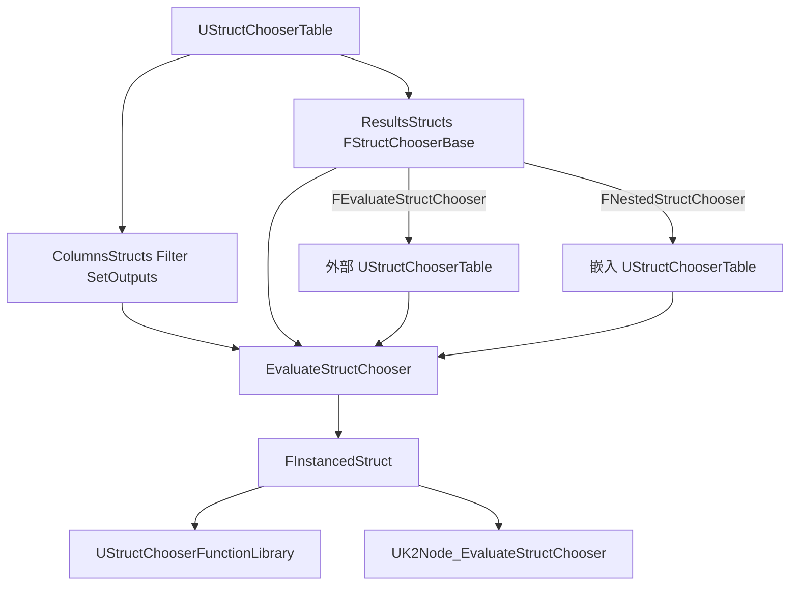

# 总架构与模块边界

> **角色**：说明插件定位、三模块职责与主数据流，作为改造时的边界地图。
> **何时阅读**：首次接触插件；需要判断改动应落在 Runtime / Editor / Uncooked 哪一层时。
> **相关源码**：`StructChooser.uplugin`、`Source/StructChooser/`、`Source/StructChooserEditor/`、`Source/StructChooserUncooked/`
> **相关文档**：[00-routing.md](00-routing.md)、[02-glossary.md](02-glossary.md)、[10-asset-model.md](10-asset-model.md)
> **最后更新**：2026-07-26

## 定位

StructChooser 提供 **以 `FInstancedStruct` 为主结果** 的 Chooser 表：

- 资产 `UStructChooserTable` **继承**引擎 `UChooserTable`，复用 Context 参数、Filter/Output 列、Nested 外层与表编辑器壳。
- 主结果 **不**走父类 `EvaluateChooser`（硬绑 `UObject*`），而走本插件 `EvaluateStructChooser`。
- 行结果为 `FStructChooserBase` 派生（存进父类 `ResultsStructs`），支持 Struct 值 / Evaluate 外链表 / Nested 嵌入表。

与引擎 `NoPrimaryResult` 的区别：NoPrimaryResult 只写 Context Output、禁止 Nested/Evaluate；本插件要主结果结构体 **且** 可嵌套。

| | StructChooser | 引擎 Object Chooser | 引擎 NoPrimaryResult |
|--|---------------|-------------------|----------------------|
| 主结果 | `FInstancedStruct` | `UObject*` / Class | 无 |
| Nested/Evaluate | Struct 版 | Object 版 | 不支持 |
| 消费节点 | Evaluate Struct Chooser | Evaluate Chooser | 无 Result 引脚 |

## 三模块边界

| 模块 | Loading | 可依赖 | 不可做 |
|------|---------|--------|--------|
| **StructChooser** | Runtime / Default | 表、行结果、评估、Library、测试 | 不应依赖 Editor/Slate；不放 K2 节点 |
| **StructChooserEditor** | Editor / Default | 工厂、控件、Details、打开表编辑器 | 不承载 cooked 评估逻辑；不改引擎源码 |
| **StructChooserUncooked** | UncookedOnly / PreDefault | K2 节点 Expand | 不进 Shipping 运行时加载 |

## 主数据流

## 关键类型锚点

| 概念 | 类型 | 路径 |
|------|------|------|
| 表资产 | `UStructChooserTable` | `Source/StructChooser/Public/StructChooserTable.h` |
| 行结果基类 | `FStructChooserBase` | `Source/StructChooser/Public/StructChooserTypes.h` |
| 结构体值行 | `FStructValueChooser` | 同上 |
| 外链评估行 | `FEvaluateStructChooser` | 同上 |
| 嵌入评估行 | `FNestedStructChooser` | 同上 |
| Library | `UStructChooserFunctionLibrary` | `Source/StructChooser/Public/StructChooserFunctionLibrary.h` |
| K2 节点 | `UK2Node_EvaluateStructChooser` | `Source/StructChooserUncooked/Private/EvaluateStructChooserNode.h` |
| 工厂 | `UStructChooserTableFactory` | `Source/StructChooserEditor/Private/StructChooserFactory.h` |
| Result 控件 | `CreateStructValueChooserWidget` 等 | `Source/StructChooserEditor/Private/StructChooserEditorWidgets.cpp` |

## 已知要点

1. **父类 ResultType 占位**：构造时设为 `ObjectResult`，仅为让引擎编辑器画出 Result 列；业务类型以 `OutputStructType` 为准。见 [10-asset-model.md](10-asset-model.md)。
2. **评估权威**：`UStructChooserTable::EvaluateStructChooser`。见 [11-evaluation.md](11-evaluation.md)。
3. **编辑器复用**：打开资产时转发到引擎 `UChooserTable` 的 AssetDefinition，从而使用 `FChooserTableEditor`。见 [40-editor-tooling.md](40-editor-tooling.md)。
4. **类型菜单**：不改引擎时 Add Row/单元格仍可能混排；行 Details 已过滤，误选 PostEdit 纠正。见 D1 / [40-editor-tooling.md](40-editor-tooling.md)。

## 待充实

- 最短上手 GIF / 分步截图：新建表 → 填 Name → Details 填 Value → BP 取结果
