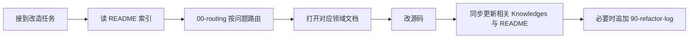

# AI 协作与知识库维护

> **角色**：约定 AI / 协作者在改 StructChooser 时如何读写知识库，保证文档不腐化。
> **何时阅读**：任何改代码会话开始前（与 README 一起）；改完准备收尾时。
> **相关源码**：无（过程约定）
> **相关文档**：[README.md](../README.md)、[00-routing.md](00-routing.md)、[90-refactor-log.md](90-refactor-log.md)
> **最后更新**：2026-07-26

## 标准工作流

1. **读** [README.md](../README.md) 知识索引。
2. **路由** [00-routing.md](00-routing.md)。
3. **读** 对应领域文档（及 [02-glossary.md](02-glossary.md) 如有新术语）。
4. **改** 源码（遵守模块边界：[01-architecture.md](01-architecture.md)）。
5. **同步** 文档（见下表）。
6. **记日志**：行为或架构有决策时追加 [90-refactor-log.md](90-refactor-log.md)，并更新 README「改造状态」。

## 改动类型 → 必须更新的文档

| 改动类型 | 必须更新 | 建议更新 |
|----------|----------|----------|
| 模块边界 / 主数据流 | `01-architecture.md`、README | `00-routing.md` |
| 新术语或重命名 | `02-glossary.md` | 引用处全文检索 |
| 表资产 / 行结果类型 | `10-asset-model.md` | |
| 评估 / Nested / Evaluate | `11-evaluation.md` | `10-asset-model.md` |
| Library / K2 节点 | `13-runtime-consumer.md` | |
| 工厂 / Result UI / Details | `40-editor-tooling.md` | `60-known-debt.md`（D1：不改引擎） |
| 关闭或新增技术债 | `60-known-debt.md` | `90-refactor-log.md` |
| 任何架构/行为决策 | `90-refactor-log.md`、README 改造状态 | |

## 文档写作约定

- **语言**：中文正文 + 关键类型/API 保留英文。
- **文首元信息**：每篇保持「角色 / 何时阅读 / 相关源码 / 相关文档 / 最后更新」；改内容时更新「最后更新」日期。
- **一篇一责**：不要把新主题塞进无关文档；若需新主题，先更新 README 索引与 `00-routing.md`，再新增编号文档。
- **骨架诚实**：未核实的细节放在「待充实」，不要编造 API 行为。
- **路径**：优先写相对插件根的路径（如 `Source/StructChooser/Public/...`）。
- **引擎**：约定不修改 `Engine/Plugins/Chooser` 源码；需要过滤菜单时优先自建编辑器或接受 D1。
- **中文注释**：编辑含中文的源码时避免 PowerShell `Set-Content` 破坏编码；优先编辑器写入或 UTF-8 无 BOM。

## 禁止事项

- 禁止只改代码不改会失效的知识文档（尤其是路由表、架构图、Cookbook 步骤）。
- 禁止在 `.Knowledges` 外再散落第二套插件知识文档（README 索引除外）。
- 禁止把引擎 Chooser 全手册抄进本库；只记录本插件挂钩与差异。
- 禁止删除 [60-known-debt.md](60-known-debt.md) 历史条目而不留「已解决」痕迹。
- 禁止用文档替代真正的源码修复说明（日志里要写清改了什么）。

## 会话收尾检查清单

- [ ] README 索引仍准确（新增文档是否已登记）
- [ ] `00-routing.md` 任务/症状是否需新行
- [ ] 触及的领域文档「最后更新」与要点已改
- [ ] 若有决策：`90-refactor-log.md` 已追加
- [ ] 若还债：`60-known-debt.md` 已标记
- [ ] README「改造状态」与阶段一致
